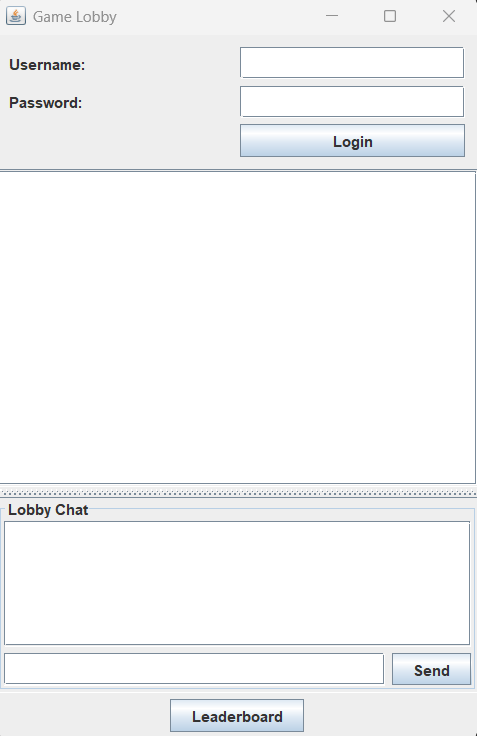
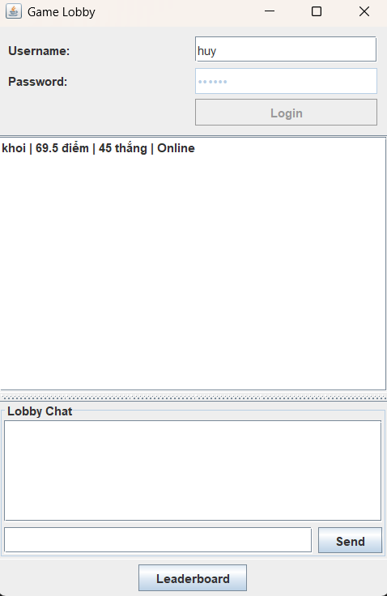
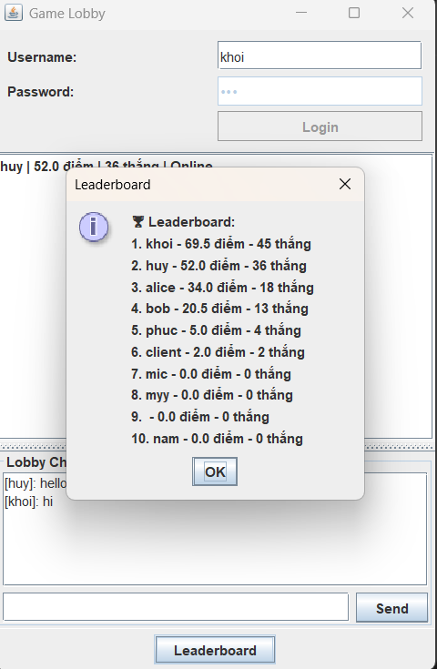
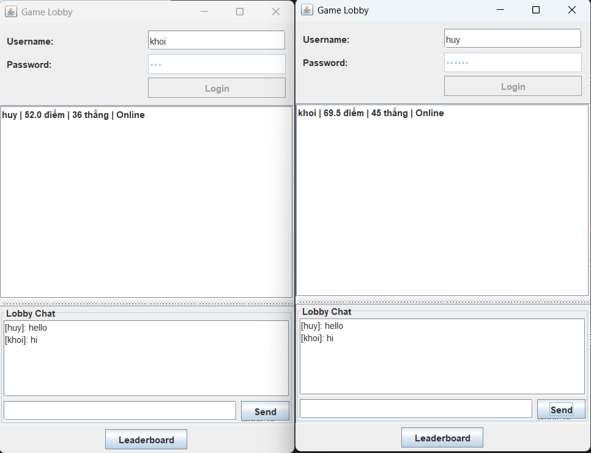
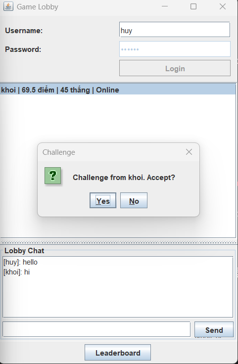
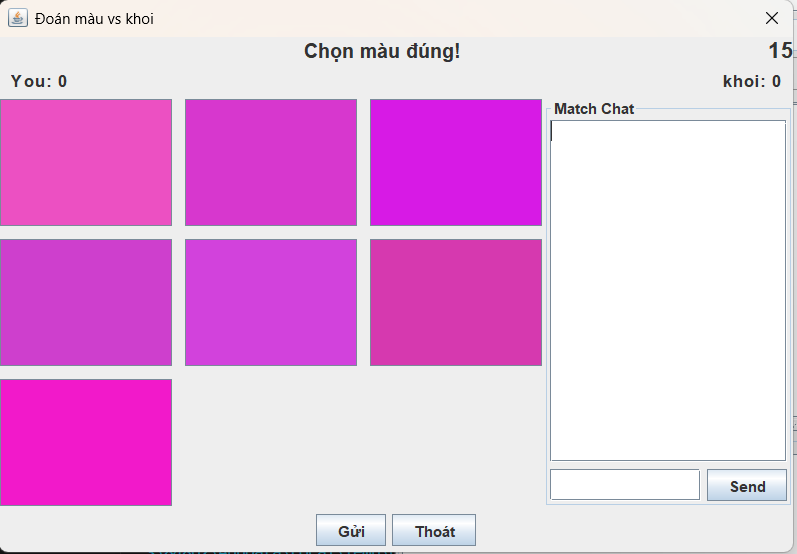
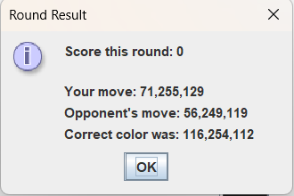
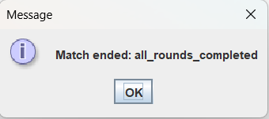
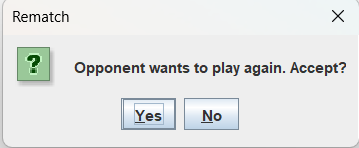

# 🎨 Color Guessing Game Online

The system operates under a **Client–Server architecture**, designed with:

* 🧩 **Service-Oriented** and **Event-Driven** architecture on the **Server side**.
* 🖥️ **MVC (Model–View–Controller)** architecture on the **Client side**.

This online color-guessing game allows players to **challenge others**, **view leaderboards**, and **chat globally** in real time.

---

## 🚪 Login Interface

  

---

## 🏠 Lobby

  

---

## 🏆 Leaderboard

  

---

## 💬 Global Chat

  

---

## ⚔️ Player Challenge

  

---

## 🎯 In-Match Interface

  

---

## 📊 Round Result

  

---

## 🏁 Match End

  

---

## 🔁 Rematch Request

  

---

📘 *This project demonstrates the use of event-driven communication, network interaction, and service-oriented architecture in an online multiplayer game.*

